# E.N.I.C. - Electronic Networked Intelligence Company

**Project:** Autonomous AI-Driven Mobile Unit (Prototype V1)  
**Platform:** ESP32 Embedded System  
**Developers:** Sertac ALAN & Kaan GUNER
---

## 📖 Overview

**E.N.I.C.** (Electronic Networked Intelligence Company) represents a forward-thinking initiative integrating electronics, network connectivity, and artificial intelligence. 

This repository hosts the source code for the **E.N.I.C. V1 Prototype**, an autonomous mobile robot designed to simulate emotional intelligence and adaptive interaction. The system leverages a Finite State Machine (FSM) architecture on the ESP32 platform to manage real-time tasks including obstacle avoidance, procedural facial animation, and command processing.

## 🚀 Key Features

* **Intelligent Navigation:** Autonomous movement with real-time obstacle avoidance algorithms using ultrasonic feedback and differential steering logic.
* **Emotional AI Engine:** Procedural facial expression generation (Blink, Shock, Happy, Dead, etc.) rendered on an SSD1306 OLED display.
* **Multi-Modal Interaction:**
    * **Voice/Serial Interface:** Parsing of string-based commands for state control (e.g., `otonom`, `dans`, `kork`, `bomb`).
    * **Auditory Feedback:** Non-blocking tone generation for status indication and "voice" simulation.
* **Advanced Operation Modes:**
    * **Dance Mode:** Choreographed motor and buzzer synchronization.
    * **Bomb Mode:** A complex visual and auditory countdown sequence demonstrating high-speed timer management.
* **High-Performance Architecture:** Entirely non-blocking code structure using `millis()` scheduling, allowing simultaneous motor control, sensing, and rendering without thread blocking.

## 🛠️ Hardware Specifications

The prototype is built upon the **ESP32 Development Module**, utilizing its dual-core capabilities for handling I/O and logic simultaneously.

### Pin Configuration (Pinout)

| Component | ESP32 GPIO | Function | Description |
| :--- | :--- | :--- | :--- |
| **Left Motor** | 26, 27 | PWM / Logic | L298N Driver Input (IN1, IN2) |
| **Right Motor** | 14, 12 | PWM / Logic | L298N Driver Input (IN3, IN4) |
| **Ultrasonic Sensor** | 5 | Output | Trigger Pin |
| **Ultrasonic Sensor** | 18 | Input | Echo Pin |
| **OLED Display** | 21 | SDA | I2C Data Line |
| **OLED Display** | 22 | SCL | I2C Clock Line |
| **Buzzer** | 4 | PWM | Audio Feedback Output |

## 🧩 Software Architecture

The codebase adheres to strict **Object-Oriented Programming (OOP)** principles to ensure modularity and scalability:

* **`EnicStateMachine`**: The central controller acting as the "Brain," managing state transitions (IDLE, AUTO, AVOIDING, DANCE, BOMB).
* **`EnicMotor`**: Handles PWM generation, speed ramping, and differential drive kinematics.
* **`EnicFace`**: Manages the I2C OLED display, drawing procedural graphics and expressions.
* **`EnicSense`**: Abstraction layer for sensor data acquisition (Sonar) and filtering (Exponential Moving Average).
* **`EnicBomb`**: A specialized class managing the time-critical countdown logic and animations.

## 📦 Installation & Build

1.  **Clone the Repository:**
    ```bash
    git clone https://github.com/sertacalansa/projectenic.git
    ```
2.  **Environment Setup:**
    * Open the project in **VS Code** with **PlatformIO** (recommended) or Arduino IDE.
    * Ensure the target board is set to `esp32dev`.
3.  **Dependencies:**
    Install the following libraries via Library Manager:
    * `Adafruit GFX Library`
    * `Adafruit SSD1306`
4.  **Upload:**
    Connect the ESP32 via USB and flash the firmware.

## 🎮 Command Interface (Serial)

The system accepts commands via UART (Baud Rate: `115200`).

* **System Commands:**
    * `otonom` : Engage autonomous navigation mode.
    * `dur` : Emergency stop / Idle mode.
    * `dans` : Execute dance choreography.
    * `bomb` : Initiate countdown sequence.
* **Emotional Triggers:**
    * `konus` (Speak), `sasir` (Shock), `kork` (Fear), `agla` (Cry).


## 🔌 Circuit Diagram (Wiring)

```mermaid
graph TD
    %% BileÅŸenler
    ESP32[ESP32 Brain]
    L298N[L298N Motor Driver]
    OLED[OLED Display I2C]
    HCSR04[Ultrasonic Sensor]
    Buzzer((Buzzer))
    Wheels((Wheels))

    %% Bağlantılar
    ESP32 -- GPIO 26, 27 --> L298N
    ESP32 -- GPIO 14, 12 --> L298N
    L298N ==> Wheels
    
    ESP32 -- GPIO 21 SDA --> OLED
    ESP32 -- GPIO 22 SCL --> OLED
    
    ESP32 -- GPIO 5 Trig --> HCSR04
    HCSR04 -- GPIO 18 Echo --> ESP32
    
    ESP32 -- GPIO 4 --> Buzzer
    
    %% Renklendirme
    style ESP32 fill:#f9f,stroke:#333,stroke-width:2px
    style L298N fill:#ff9,stroke:#333
    style OLED fill:#9ff,stroke:#333
```


    

## 📄 License

This project is open-source software distributed under the [MIT License](LICENSE).